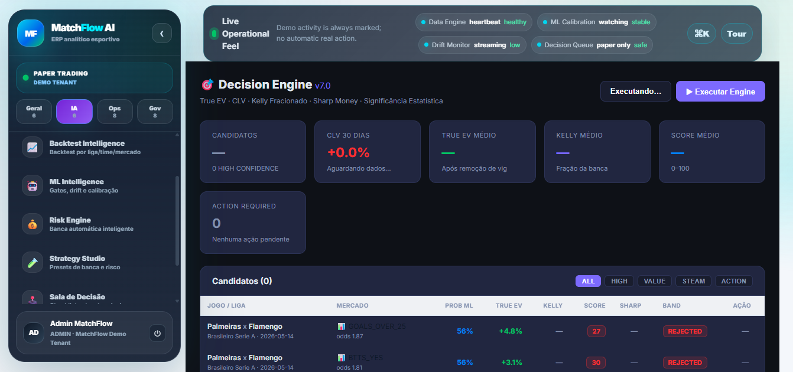
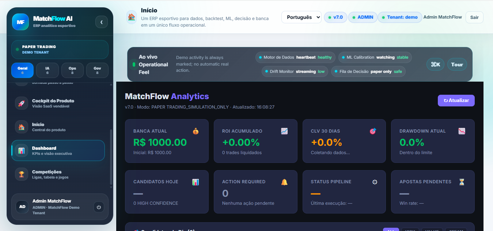
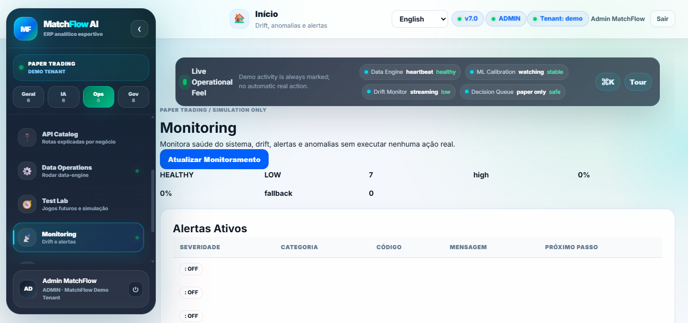
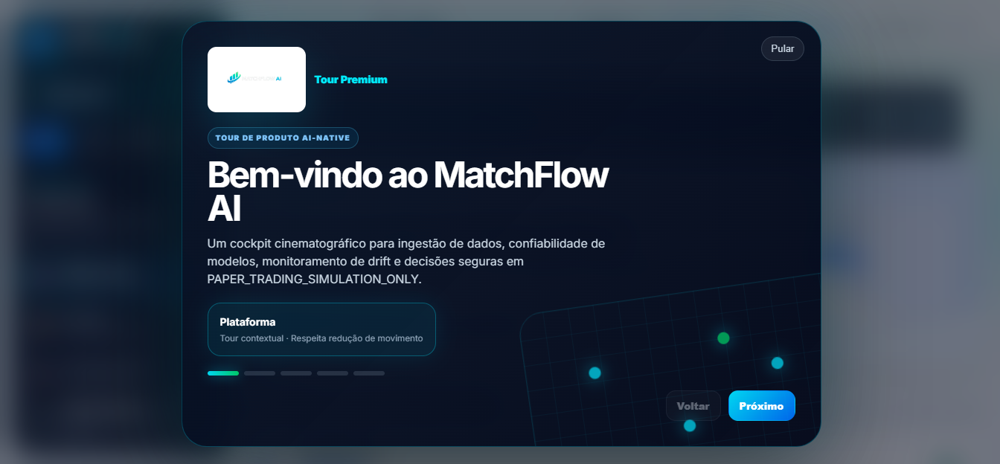

<div align="center">


<br>


<br><br>


<br><br>


</div>

---

# ⚽ MatchFlow AI

O MatchFlow AI é uma plataforma AI-native de inteligência esportiva desenvolvida para transformar dados futebolísticos em:

- pipelines inteligentes;
- modelos de Machine Learning;
- backtests;
- Decision Engine;
- monitoramento operacional;
- analytics;
- paper trading;
- automações e inteligência analítica.

A plataforma combina Engenharia de Dados, IA, automação e análise quantitativa em uma experiência moderna de produto SaaS.

> Segurança em primeiro lugar: o sistema opera em `PAPER_TRADING_SIMULATION_ONLY` e não executa apostas reais automaticamente.

---

# 🚀 Principais Features

<div align="center">

| IA & Machine Learning | Data Engine | Camada de Produto |
|---|---|---|
| Ensemble Models | Provider interno FlashScore | Dashboard Premium |
| Calibration | Consolidação de dados | Monitoring Center |
| Drift Monitoring | Canonical Mapping | Executive Cockpit |
| Pipeline de Predições | Relatórios de qualidade | AI Copilot |
| ML Intelligence | Enrichment Layer | Live Center |

</div>

---

# 🧠 Arquitetura Geral

<div align="center">

```text
FlashScore
     ↓
Data Engine
     ↓
Engenharia de Features
     ↓
Pipeline de Machine Learning
     ↓
Decision Engine
     ↓
Paper Trading
     ↓
Monitoramento & Inteligência Artificial
```

</div>

---

# 📸 Plataforma

## 🎯 Decision Engine



<br>

## 📊 Dashboard & Camada Inteligente



<br>

## 📡 Monitoramento & Analytics



<br>

## ✨ Onboarding Premium



---

# ⚡ Stack Tecnológica

<div align="center">


<br><br>


</div>

---

# 📂 Estrutura do Projeto

```text
backend/                 → Backend FastAPI
frontend/                → Frontend React + Vite
06_ml/                   → Pipeline de ML
09_decision_engine/      → Motor de decisão
10_monitoring/           → Monitoramento e alertas
11_automation/           → Jobs e automações
docs/                    → Documentação técnica
config/                  → Configurações do sistema
```

---

# ⚡ Quick Start

## Backend

```bash
python -m venv .venv

# Linux / Mac
source .venv/bin/activate

# Windows
.venv\Scripts\activate

pip install -r requirements-backend.txt

cp .env.example .env

uvicorn backend.main:app --host 127.0.0.1 --port 8000
```

---

## Frontend

```bash
cd frontend

cp .env.example .env

npm install
npm run dev
```

---

# 🧪 Modo Demo

```env
DEMO_MODE=true
APP_MODE=PAPER_TRADING_SIMULATION_ONLY
```

---

# 📊 Módulos Principais

- Dashboard
- Data Operations
- Team Analytics
- Backtest Lab
- ML Intelligence
- Decision Engine
- Paper Trading Premium
- AI Copilot
- Monitoring Center
- Executive Cockpit
- Cognitive Workspace

---

# 📚 Documentação Técnica

<div align="center">

| Documento | Descrição |
|---|---|
| `docs/TECHNICAL_OVERVIEW.md` | Visão técnica completa |
| `docs/ML_PIPELINE.md` | Pipeline de ML |
| `docs/DATA_ENGINE_OPS.md` | Data Engine |
| `docs/MONITORING.md` | Monitoramento e alertas |
| `docs/DEPLOYMENT.md` | Deploy |
| `docs/TROUBLESHOOTING.md` | Troubleshooting |

</div>

---

# 🔒 Segurança

O MatchFlow opera exclusivamente em modo de simulação e não realiza apostas automáticas com dinheiro real.

Todas as predições, sinais e análises são destinadas para:
- pesquisa;
- experimentação;
- paper trading;
- workflows analíticos;
- validação operacional.

---

# 📈 Visão da Plataforma

O MatchFlow foi projetado como uma plataforma modular AI-native focada em:

- escalabilidade;
- explicabilidade;
- monitoramento;
- automação;
- engenharia de dados;
- inteligência operacional;
- analytics esportivo.

---

<div align="center">


<br><br>

### Construindo sistemas inteligentes através de dados, automação e IA.

</div>

---


